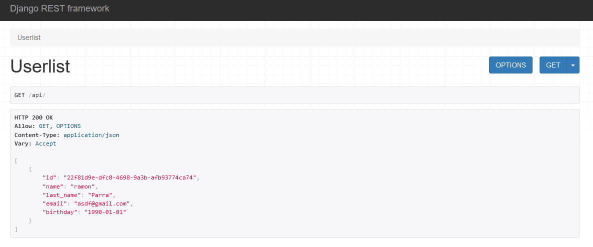
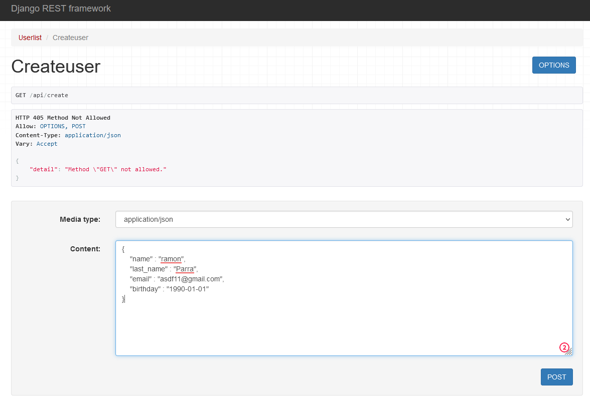
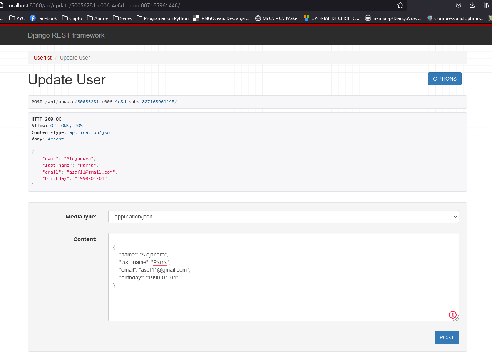
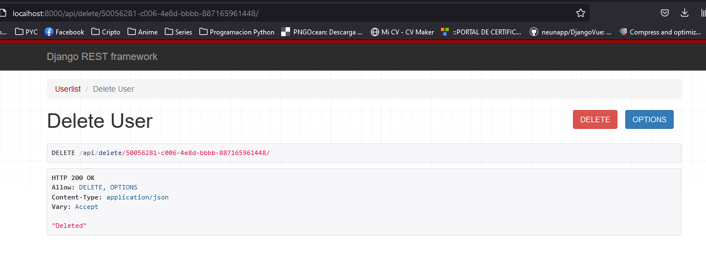

# Python/Django Challenge

## Descripcion

Aplicacion django para hacer CRUD con API 

## Como ejecutar el Projecto

* crear el virtualenv: `python -m venv virtualenv`.
* activar el virtualenv `.python virtualenv/bin/activate`.
* Instalar dependencias: `pip install -r requirements.txt`
* Iniciar el proyecto : ` python manage.py runserver`

# How to Use

* El proyecto se ejecutara en localhost:8000/api

* Luego accediendo a localhost:8000/api/create se puede crear un nuevo usuario, la id del usuario es uuid y es generada automaticamente, 
ademas valida que el email sea unico

* Para hacer alguna modificacion de algun registro se hace accediendo a localhost:8000/api/update/<primary_key> , en donde primary_key es 
el id del registro a editar

* Para eliminar un registro se hace accediendo a localhost:8000/api/delete/<primary_key> , en donde primary_key es el id del registro a eliminar

